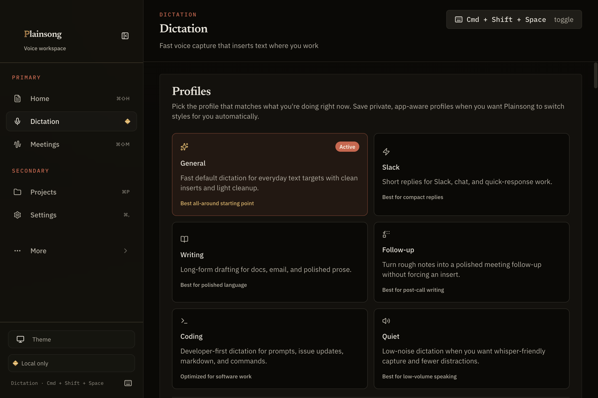
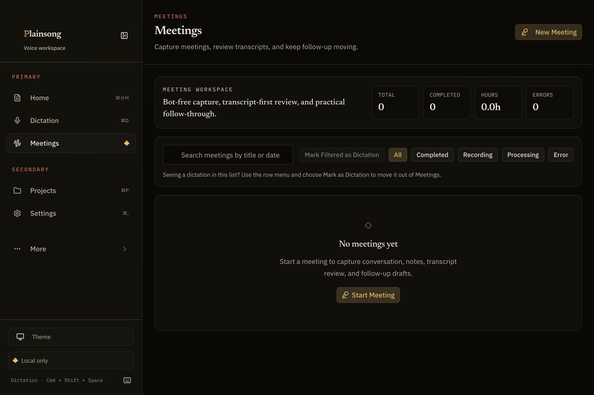

# Plainsong

**Free, open-source, local-first voice input for your whole computer.**

**[Website](https://plainsong.jonathanrreed.com)** ·
**[Releases](https://github.com/JonathanRReed/Plainsong/releases)** ·
**[Privacy](./PRIVACY.md)** · **[Contributing](./CONTRIBUTING.md)**

Plainsong is a desktop app for fast system-wide dictation and bot-free meeting
capture. Press a hotkey, speak, and your words appear at the cursor in any app,
transcribed on your own machine. Meetings are recorded, transcribed, and turned
into searchable notes without sending a bot into your call.



- **Local-first.** Transcription runs on your Mac by default. No account, no
  cloud dependency, no audio leaving your machine unless you opt in.
- **Bring your own keys.** Optional cloud transcription and AI cleanup use your
  own keys for providers such as OpenAI, Anthropic, ElevenLabs, Groq,
  Cohere, DeepSeek, and Gemini. Usage is billed to you, keys are stored in the OS keychain,
  never routed through our servers.
- **Actually free and open.** MIT licensed, no trial, no tiers, no nags. Build
  it yourself today; the first public release will follow completion of the
  remaining beta qualification gates and explicit distribution approval.

> Status: this is an active rebuild of a previously commercial app into a fully
> free, open-source project. macOS is the primary target today; Windows and
> Linux are on the roadmap.

## Features

- System-wide dictation via a global hotkey, with a focus-preserving overlay
- Three activation modes: toggle, hold-to-talk (native key listener), and
  hands-free voice-activity detection
- Local speech recognition (Parakeet by default, plus Whisper and other
  engines) with optional BYOK cloud
- Dictation modes, snippets, a personal dictionary, and editing commands
- Meeting recording (microphone, plus system audio where available), transcript
  review, summaries, action items, and cross-meeting search
- Optional local AI analysis via Ollama, or BYOK cloud providers



## Install

The Plainsong `0.9.0-beta.2` integration candidate targets **macOS 13 or later
on Apple Silicon (arm64)**.

> Beta status, August 22, 2026: source integration and exact-candidate
> qualification are in progress. Historical `1.0.0` and `0.9.0-beta.1`
> artifacts do not prove the current build. No installer is public or approved
> for distribution. The current revision must produce fresh package, trust,
> clean-install, Dictation, Meetings, and updater evidence before invitations.

Invited testers will receive a verified DMG and its SHA-256 checksum only after
the release gate passes and distribution is explicitly approved:

1. Download the DMG.
2. Drag `Plainsong.app` into `/Applications`.
3. On first run, grant Microphone access so Plainsong can hear you and
   Accessibility access so it can insert text into other apps. Then let it
   download the recommended default model, Parakeet TDT 0.6B v3 (640 MB);
   Whisper `base.en` (142 MB) is offered as a smaller, less accurate
   alternative.

Homebrew is planned after the beta and first public release (see
[nautilus-bot/docs/homebrew.md](./nautilus-bot/docs/homebrew.md)).

## Quick start (from source)

The app lives in [`nautilus-bot/`](./nautilus-bot/).

```bash
cd nautilus-bot
bun install
bun run sidecar:build:release   # build the Rust transcription sidecar (required once)
bun run dev
```

Or run `./setup.sh` inside `nautilus-bot/`, which checks prerequisites and does
the equivalent.

### Prerequisites

- [Bun](https://bun.sh)
- Rust toolchain (stable), which builds the local transcription sidecar
- [CMake](https://cmake.org/)
- Xcode Command Line Tools, including `xcrun` and the Swift compiler (`swiftc`);
  install them with `xcode-select --install`
- macOS 13 or later on Apple Silicon (Windows/Linux are not yet GA targets)
- Optional: [Ollama](https://ollama.com) running locally for on-device AI cleanup

## Verifying a change

```bash
cd nautilus-bot
bun run lint        # typecheck + cargo fmt + clippy
bun run test        # renderer/Electron tests (Vitest)
bun run test:rust   # Rust sidecar unit tests
```

Use `bun run test` (Vitest), not `bun test`.

## Contributing

Contributions are welcome. See [CONTRIBUTING.md](./CONTRIBUTING.md). Security
reports go to [SECURITY.md](./SECURITY.md). What the app does and does not do
with your audio is documented in [PRIVACY.md](./PRIVACY.md).

## License

[MIT](./LICENSE) © 2026 Jonathan Reed
