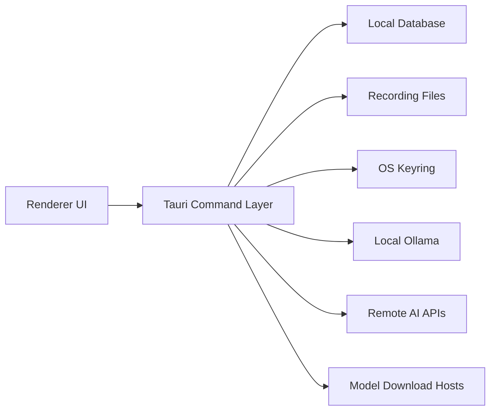

## Assumption-Validation Check-In
- App runs primarily as a desktop Tauri client on managed macOS and Windows endpoints.
- Data includes business-confidential meeting recordings/transcripts and provider credentials.
- Default trust objective is local-first processing; remote AI use is exceptional and explicit.
- Device compromise is out of scope; malicious local user with same OS account is in scope.
- CI/CD and dependency supply-chain are in scope only where they affect shipped artifacts.

Questions to confirm for next revision:
1. Is Nautilus expected to run on shared workstations, or only single-user managed devices?
2. Is there a formal enterprise key-management requirement (for example external KMS/HSM) beyond OS keyring?
3. Is remote provider usage allowed for any regulated data classes, or must some projects remain strictly local?

_No additional context was provided during this implementation run; model below proceeds with these assumptions._

## Executive summary
Top risks are policy bypass of remote transcript egress, unauthorized read/write of recording artifacts, and tampered model/runtime inputs. This cycle materially reduced risk by enforcing backend remote-provider policy, keyring-only provider credential retrieval in analysis paths, vault-based artifact encryption/decryption flow, and constrained export paths; residual risk is mainly dependency lifecycle and operational hardening.

## Scope and assumptions
- In scope:
  - `/Users/jonathanreed/Downloads/NautilusBot/nautilus-bot/src-tauri/src`
  - `/Users/jonathanreed/Downloads/NautilusBot/nautilus-bot/src`
  - `/Users/jonathanreed/Downloads/NautilusBot/nautilus-bot/src-tauri/Cargo.toml`
  - `/Users/jonathanreed/Downloads/NautilusBot/.github/workflows/ci.yml`
- Out of scope:
  - OS kernel compromise and physical exfiltration bypassing process controls.
  - Third-party provider-side controls not visible from repo.
- Open questions that can change priority:
  - Multi-user endpoint vs single-user endpoint deployments.
  - Mandatory enterprise key escrow/KMS requirements.
  - Data-class-specific remote AI prohibition rules.

## System model
### Primary components
- Renderer UI (React/TypeScript): settings and command invocation surface.
- Tauri backend command layer: command authorization, policy checks, IO routing (`src-tauri/src/lib.rs`).
- Local persistence: SQLite/SQLCipher DB and recording artifacts (`src-tauri/src/db.rs`, `src-tauri/src/lib.rs`).
- Secrets layer: OS keyring access (`src-tauri/src/secrets.rs`).
- LLM/ASR integrations: local Ollama + optional remote providers (`src-tauri/src/llm/*`, `src-tauri/src/asr/*`).
- Download subsystem: model artifact retrieval/integrity verification (`src-tauri/src/download/mod.rs`).
- CI quality gates: release build/test/audit checks (`.github/workflows/ci.yml`).

### Data flows and trust boundaries
- User UI -> Tauri commands
  - Data: transcript query text, export paths, provider settings, vault passwords.
  - Channel: Tauri IPC invoke.
  - Guarantees: command-level validation and explicit policy checks in backend.
  - Validation: path canonicalization, provider policy enforcement, credential presence checks.
- Tauri backend -> local DB/filesystem
  - Data: recordings, transcripts, audit events, settings.
  - Channel: local filesystem and SQLite driver.
  - Guarantees: approved root checks for sensitive path operations.
  - Validation: `canonicalize_*`, approved-root enforcement, encryption path checks.
- Tauri backend -> OS keyring
  - Data: provider API keys, vault verifier/db key secrets.
  - Channel: keyring crate APIs.
  - Guarantees: OS-protected secret store.
  - Validation: deterministic missing-secret error paths for remote providers.
- Tauri backend -> remote AI/model host
  - Data: transcript text and model artifacts.
  - Channel: HTTPS via reqwest.
  - Guarantees: TLS transport and response checksum verification for model downloads (when digest headers are present).
  - Validation: remote provider disabled by default; explicit opt-in required.

#### Diagram

## Assets and security objectives
| Asset | Why it matters | Security objective (C/I/A) |
| --- | --- | --- |
| Meeting audio/transcripts | Business-confidential content and user trust | C, I |
| Provider API credentials | Prevent unauthorized provider usage and billing abuse | C, I |
| Vault key material and verifier | Gate decryption and encrypted migration controls | C, I |
| Exported artifacts/evidence bundles | Potential legal/compliance evidence | I, C |
| Model artifacts/runtime files | Tamper could alter transcript quality or execute malicious behavior path | I, A |
| Audit logs | Forensics and accountability | I, A |

## Attacker model
### Capabilities
- Can trigger UI actions/commands as an authenticated local user.
- Can attempt malicious path inputs (exports/open operations).
- Can tamper with downloaded files on disk post-download.
- Can attempt to force remote provider usage via settings/UI mismatch.

### Non-capabilities
- Cannot bypass OS keyring protections directly through this app alone.
- Cannot break TLS cryptography directly.
- Does not have guaranteed OS root/admin compromise by default assumption.

## Entry points and attack surfaces
| Surface | How reached | Trust boundary | Notes | Evidence (repo path / symbol) |
| --- | --- | --- | --- | --- |
| `analyze_recording` / `summarize_recording` / `extract_action_items` | UI invoke | UI -> backend -> local/remote provider | Remote egress policy and key checks now centralized | `src-tauri/src/lib.rs` `run_*_with_selected_provider` |
| Export commands | UI invoke with target path | UI -> backend -> filesystem | Requires canonical absolute target under allowed root | `src-tauri/src/lib.rs` `validate_export_target_path` |
| Vault commands | UI invoke with password | UI -> backend -> key derivation/filesystem | Unlock verifier and migration path are security-critical | `src-tauri/src/lib.rs` `unlock_vault_runtime` |
| Audio open/waveform/diarization | UI invoke with recording id/path | backend -> filesystem/decrypt temp | Encrypted file runtime decrypt path can leak if temp handling fails | `src-tauri/src/lib.rs` `resolve_audio_path_for_runtime` |
| Model downloads | ASR provider download flow | backend -> internet -> filesystem | Digest metadata check added; depends on header availability | `src-tauri/src/download/mod.rs` `extract_sha256_from_headers` |

## Top abuse paths
1. Attacker selects remote LLM provider while policy disabled -> backend previously might process remotely -> confidential transcript egress.
2. Attacker submits export target outside expected storage root -> overwrite or exfiltrate data to arbitrary location.
3. Attacker tampers model artifact on disk/network path -> poisoned ASR behavior and unreliable transcript output.
4. Attacker attempts repeated vault unlock attempts -> brute-force weak password and access encrypted artifacts.
5. Attacker invokes audio open on encrypted artifact with stale state -> obtain decrypted temp file if cleanup fails.
6. Attacker uses missing/ambiguous provider secrets path -> force fallback to env credentials and bypass intended secret policy.

## Threat model table
| Threat ID | Threat source | Prerequisites | Threat action | Impact | Impacted assets | Existing controls (evidence) | Gaps | Recommended mitigations | Detection ideas | Likelihood | Impact severity | Priority |
| --- | --- | --- | --- | --- | --- | --- | --- | --- | --- | --- | --- | --- |
| TM-001 | Local user / misconfig | Remote provider selected, policy off | Force cloud analysis egress | Confidential transcript exposure | Audio/transcripts | Backend deny gate (`lib.rs` `enforce_remote_provider_policy`) | None in implemented path | Keep deny-by-default and add explicit UI confirmation for first remote enable | Audit event on remote policy denials | Medium | High | high |
| TM-002 | Local user | Access to settings/commands | Use missing secret path to invoke remote provider | Auth ambiguity and accidental egress | Credentials/transcripts | Keyring secret retrieval required (`lib.rs` `provider_secret_for`) | No key age/rotation checks | Add key age metadata and rotation reminders | Log credential-missing and provider-invoke failures | Medium | Medium | medium |
| TM-003 | Local attacker with file access | Can alter downloaded artifact | Substitute model file after/between download and use | Integrity loss in ASR output | Model artifacts | Download digest verification (`download/mod.rs`) | Verification depends on digest header presence | Add pinned checksums manifest for critical model bundles | Audit and hash-check at model load time | Medium | High | high |
| TM-004 | Local user with malformed path input | Command access | Path traversal-equivalent absolute path abuse in exports | Unauthorized write location | Exported artifacts | Canonical/absolute path checks + root enforcement (`lib.rs` `validate_export_target_path`) | Backup/export roots policy not project-scoped | Add per-project export ACL and signed policy file | Audit rejected target paths | Low | High | medium |
| TM-005 | Local brute-force attacker | Vault enabled | Repeated unlock attempts against weak password | Decryption of protected recordings | Recording artifacts, vault keys | Password-derived key + verifier (`lib.rs` `unlock_vault_runtime`) | No retry throttling/lockout | Add exponential backoff and lockout telemetry | Counter + rate alert on failed unlock attempts | Medium | Medium | medium |
| TM-006 | Process crash during decrypted runtime use | Encrypted recording open path | Leave decrypted temp file on disk | Residual plaintext leak | Recording artifacts | Temp cleanup hooks (`lib.rs` `cleanup_temp_file`, `schedule_temp_file_cleanup`) | Crash before cleanup can persist temp | Add startup scavenger for runtime temp dir | On startup, log and purge stale decrypted temp files | Low | High | medium |
| TM-007 | Dependency ecosystem risk | Build/update pipeline | Vulnerable/unmaintained transitive crates introduced | Future exploitability and support risk | App integrity/availability | CI audit gate + advisory visibility (`ci.yml`, `cargo audit`) | Many unmaintained warnings accepted | Maintain audited allowlist and update cadence | Fail CI when warning set changes unexpectedly | Medium | Medium | medium |

## Criticality calibration
- Critical: Direct unauthorized disclosure of business-confidential transcripts at scale, or bypass of vault protections leading to broad plaintext recovery.
- High: Integrity compromise of models/evidence artifacts or policy bypass requiring only normal app access.
- Medium: Operational hardening gaps with practical mitigations (unlock throttling, temp file scavenging, dependency lifecycle risk).
- Low: Nuisance or highly constrained issues with limited confidentiality/integrity impact.

Examples:
- Critical: remote egress without policy controls for all analysis commands.
- High: accepted tampered model files with no integrity check.
- Medium: repeated vault unlock brute-force with no delay.
- Low: cosmetic UI mismatch with backend policy but backend still denies.

## Focus paths for security review
| Path | Why it matters | Related Threat IDs |
| --- | --- | --- |
| `/Users/jonathanreed/Downloads/NautilusBot/nautilus-bot/src-tauri/src/lib.rs` | Main command boundary, policy enforcement, vault lifecycle, path validation | TM-001, TM-002, TM-004, TM-005, TM-006 |
| `/Users/jonathanreed/Downloads/NautilusBot/nautilus-bot/src-tauri/src/secrets.rs` | Keyring secret read/write path | TM-002 |
| `/Users/jonathanreed/Downloads/NautilusBot/nautilus-bot/src-tauri/src/download/mod.rs` | Download integrity and checksum logic | TM-003 |
| `/Users/jonathanreed/Downloads/NautilusBot/nautilus-bot/src-tauri/src/transcription.rs` | Evidence bundle generation/verification trust path | TM-004 |
| `/Users/jonathanreed/Downloads/NautilusBot/nautilus-bot/src-tauri/src/db.rs` | SQLCipher keying and persistence controls | TM-005 |
| `/Users/jonathanreed/Downloads/NautilusBot/.github/workflows/ci.yml` | Release gate enforcement and audit policy | TM-007 |

## Quality check
- Entry points covered: yes (analysis, export, vault, audio open/decrypt, model download).
- Trust boundaries represented in threats: yes.
- Runtime vs CI/dev separation: yes (runtime threats vs dependency/CI controls).
- User clarifications integrated: no additional responses received; assumptions remain explicit.
- Assumptions/open questions documented: yes.

